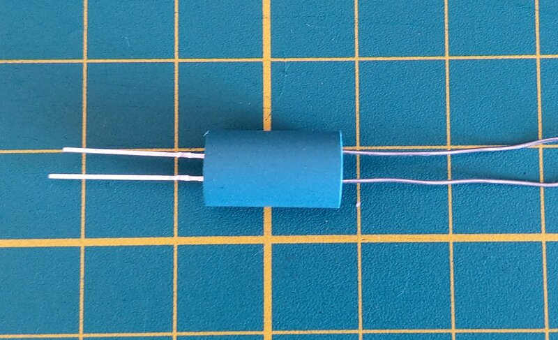
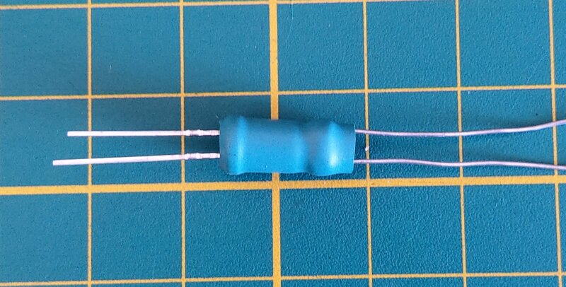
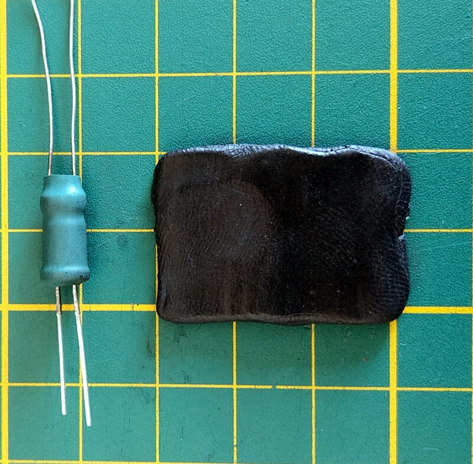
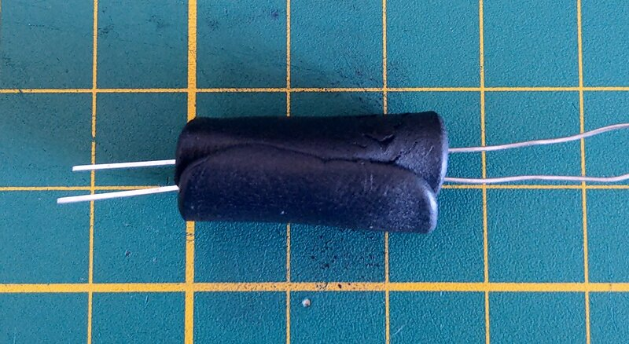
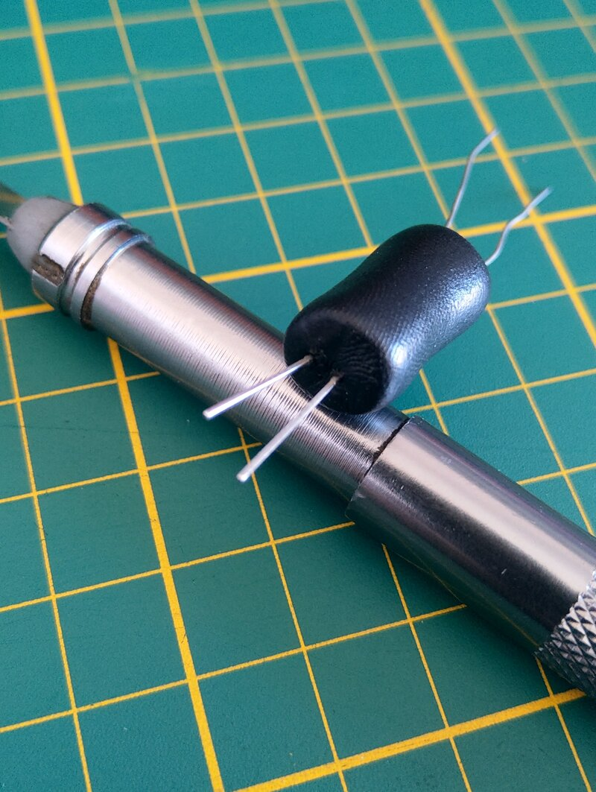
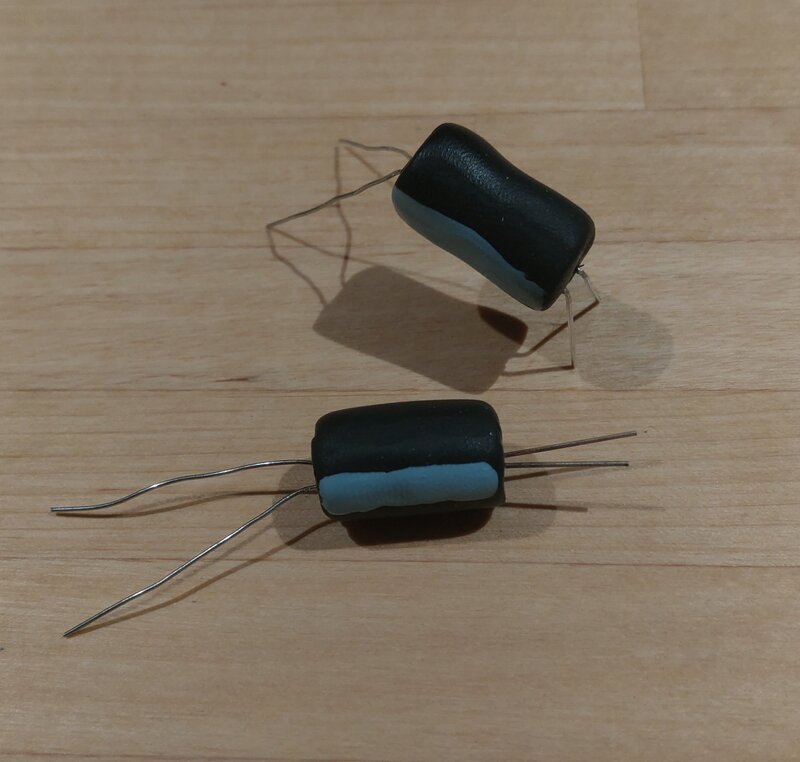

An optocoupler allows signal transmition between two isolated circuits with two parts: an LED that emits infrared light and a photosensitive device (LDR) which detects light from the LED.

Both the LED and the LDR have to be enclosed so no external light should reach the LDR. This article only describe an experienced method to make those little candies, but if you want more technical informations you can read [this excellent blog article](https://www.electronics-tutorials.ws/blog/optocoupler.html).

## Parts and tools

* knife or scalpel
* 1.5cm pieces of shrink tubes
* 1M LDR
* 5mm LED
* FIMO dough
* Convection oven

## Making the candies

Tons of tutorials are available online, generaly using the shrink-tube method only, but I already encountered some issues because of the approximative sealing, causing some light entering.

I use shrink tube only to put the pieces in place during the process, and the FIMO dough to definitely isolate the LDR from external light source.

I also only tested with red and white leds, and have a preference for the white ones.

---

First, put the LED and the LDR in the shrink tube until they make a contact. The legs have to be kind of aligned, for better usage.

Apply some heat, with a lighter or an iron, to stick them in place.

---

Prepare the FIMO dough. Depending on the quality, heat it a little by hand, to finally make it sufficiently malleable and flatten a piece of 2 x 3 cm.

Carefully place the shrinked candy in the middle of the dough, and roll it around.

Now some patience is required to adjust the dought correctly and make a perfect 2 x 1 cm cylinder.

The most important part! With a knife, flatten each backsides to completely seal and isolate the vactrol.

Try to not deform the cylinder too much, always for better future usage.

## Baking !

Here we go! Put your best kitchen crazed hat and warm up your oven at **110°C (230°F)**.

Pay attention to not use some grill or toast function, we only want to delicately bake our candies, so prefer the convection method.

**30 minutes** is exactly the time needed to bake them totally.

DO NOT TOUCH THEM IMMEDIATLY BY HAND, they are hot.

---

As you know, half of this candy is a LED, with a negative leg, so don't forget to put some nail coat to keep in mind the good side.

## Testing

A simple method to check if the vactrol is working like it should be is to put some current in the vactrol, and watch if the LDR is passing another current to a LED.

---

Well done ! You now have the capacity to make unlimited amount of vactrols !

## Credits

* [Kristian Blåsol's Vactrol baking video](https://www.youtube.com/watch?v=ljJFSOW14Rc)