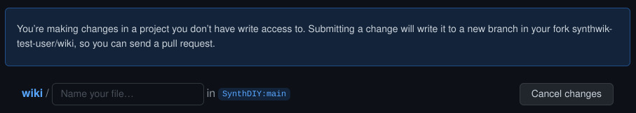
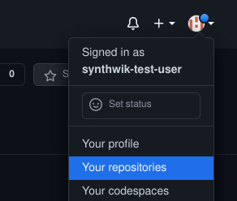
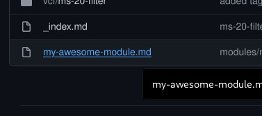
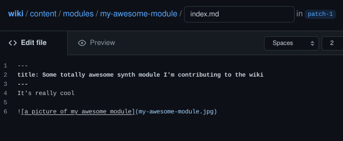
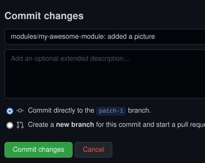
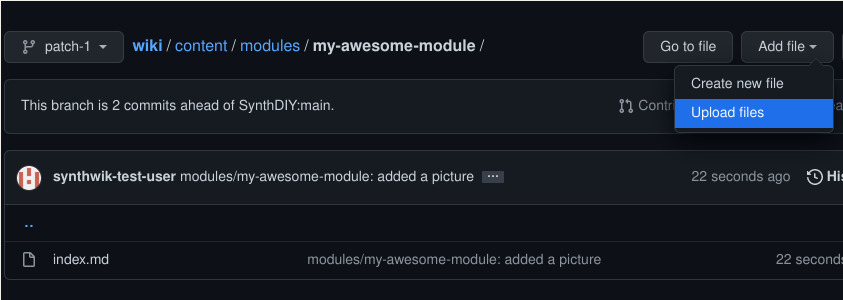
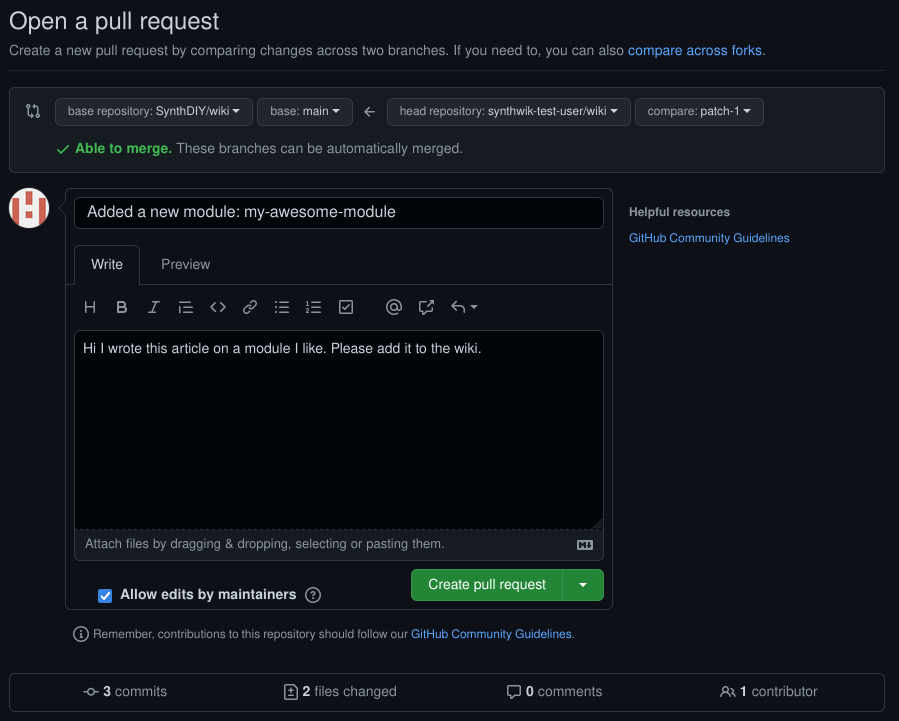

First you need to create a GitHub account, log in and navigate to [our GitHub repository](https://github.com/SynthDIY/wiki)

## Adding a simple article

Click on `Add file` -> `Create new file`

Github will notify you that it has automatically forked the repository for you.

Type in the file path of the file you want to create and type in the content of your article
(`/` works as a directory separator).
Info on article formatting and our directory structure is available in [here](../repository-structure-and-article-formatting)

After you're done with your content scroll down, type in a descriptive commit message like this and click on `Propose new file`

GitHub will then show a summary of the changes you've made. If you don't intend to add anything more you can jump straight to "Creating a pull request" down below. If you want to add more continue to the next step.

## Adding more edits and a picture

To add more files navigate to your repositories and then to your forked `wiki` repository.

You'll see a notification saying the branch GitHub created for you (in this case `patch-1`) has recent pushes.
Click on the branch name to switch to that branch.

To add a picture to our article we'll first need to move the article into it's own subfolder and rename it to `index.md`.

First navigate to the file you created and open it.

To move and rename the file click on the `Edit this file` button with a pen icon...

... and type in the new path/name for the file.

While you're here also add the reference to the image file in the article. (Do not use the GitHub's built-in "add picture" functionality, it isn't compatible with our site)

After you're done editing the file scroll down, write a descriptive commit message and hit `Commit changes`

To upload the image file click on `Add file` -> `Upload files`

Drag your file into the browser window or click on `choose your files` and select your file.

Write a descriptive commit message and hit `Commit changes`

Now if you go back to your `index.md` file you can see that the picture shows up in the preview.

## Creating a pull request

If you're done with your changes now is time to make a pull request to merge them into the main repository.

When you navigate to the branch on your fork with the changes you should see a yellow notification box saying it  has recent pushes.

Click on `Compare & pull request` and type in a descriptive name and comment for your pull request.

Leave the "Allow edits by maintainers" box checked so we can fix any issues before merging and click on `Create pull request`. Now you can just wait while one of the maintainers reads your commit and merges it to the wiki.
