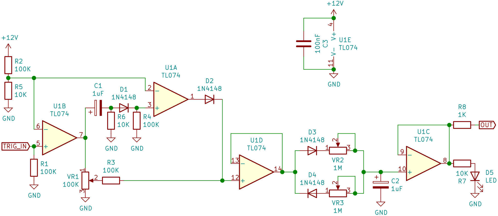
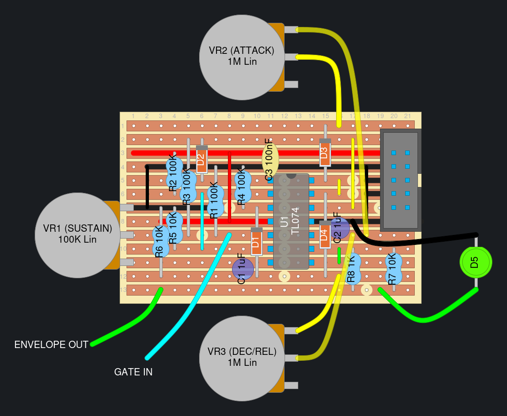

---
title: "ADSR(-ish) envelope generator"
tags: ["envelope", "veroboard"]
--- 

This is a simple but effective envelope generator designed by Moritz Klein in [his video](https://www.youtube.com/watch?v=aGFb7JbTdNU).
It approximates an ADSR by mixing together a short +12V peak and an attenuated version of the input signal and then feeding them into a capacitor through 2 diodes and potentiomters.
The opposite polarity diodes in series with the pots let you control the rate the capacitor charges and discharges at independently, so you can adjust "attack" and "decay + release" independently.

Pros:
* Simple and easy to build
* Sounds good
* Decay and release are controlled by the same knob

Cons:
* Decay and release are controlled by the same knob
* Turning up the attack "eats" the decay part of the envelope

## Schematics

### Moritz Klein's original circuit
The schematic can be seen in Moritz Klein's youtube video: ["Designing a simple ADSR(-ish) envelope generator from scratch"](https://youtu.be/aGFb7JbTdNU).

Moritz has also created [a falstad simulation of the circuit](https://www.falstad.com/circuit/circuitjs.html?ctz=CQAgjCAMB0l3BWEBmA7NMZUCYAskAOMBZANjVRAUipF2SoFMBaTAKAGMRXdcVtuBGsgE0Y8OBHHVkYAJzYEc4rILY5BKLEhg2AJW5he4VKUMKTZmgIFmrWhGwAm4Y8kh9shFB5ACnjABmAIYArgA2AC7OdLiarGYIYAIJfiABIRHRLkkCQrGa+f5BYVFsAO5UpoaJ1SJQFVVm+Qh1oo2tZvWk+PwNXD3Ctr2YoloSOuDQZPRgBLikWLKkGuM6bADmIIPgydsjxmKNO90EmvWQbMHbZ+DNcHcgmnusAmATNGDTPe5xc6QEZBJPZfGaqBZLMArZ4TY63GgA+IXOFIvIPZjIypCGgYtGfKxsABOTweUKe+TJn3gMSMfDifgQZnpxUyZS2zHycjMHM+eyOxJ5fUFXKg4AkVz69NpdE0cnAKRBHxQ0EBpFQyAWcmQBFQqAQSUozHEkC1qFwOGwYLNOoY73FlR4fHqjssDWuii6AjI5zy8sMbyVRtg7mwYA1STkCDwkD1ECDkBDYb1+AIK2wqATfDt1MqHseedSl1zjJqKABpaLZfiZO9fUrvB9BRJDUqDcl9MLRIZZmwtzz9Kp9tL9RH7Swnm8vz8tynEGzDxgi1uAGUAKrLgAqAEEAJIAOU2PidvmQZCPosr3Sdb2ql2J9SwZlGrpo5upW2fj-lz1vDXvN+5B9f3nS4DFxV1mB6F9RRGMYxGgRwAA8-GIFAz3cShTzlLM+DXTddz3AAdABnAAFAB5Dc2GQ6gcSIKgCCQZhUE0HCQC3DdtwAYQAaRIiiqOQ3AlF2JBSBjXZWNcEAABEAFEuK3ABNAB6PQ5IAGTkrdlzk-jKLYcjyXxEAFGeew72HBUzBFQd31LEVUmfI4XEFZ0axsdISiyRoXREIZ+COSpa3qNtkWuEdfGlKdngVAMJmVVV1U1bVdX1LBRRAxogM9adNErF0vz8rw-yoF4yU6CtwC7XJm0q-JXwkaAuTYAB7FA5SgxrVhKmApGq9re32GCTTlcR5BIZIkGNOA5FMRlFHANIhuQNhtRlTKxQSjjuJ4tbWLGpaQJoeTFNU9StJ0uS2CAA).

### Sandelinos' envelope generator
This is a modified version of Moritz's original circuit.

The main changes made:
* Moved the highpass portion after the comparator to make the length of the peak unaffected by the amplitude of the input signal.
* Made the circuit run on +12V/GND instead of +/-12V
  * +You can run this off of pretty much anything, even a 9V battery.
  * -The output can't go below ~120mV so VCAs might not close fully etc.
* Decreased the treshold for the input to ~1V.
* Got rid of the diode between R3 and U1D.

## Veroboard Layouts

### Sandelinos' envelope generator

Based on the schematic above. Add a socket for C2 if you want to play around with different time ranges.

[DIYLC file download](sandelinos-envgen-diylc.diy)

## Panels

[Sandelinos' envelope generator panel template](sandelinos-envgen-panel.svg) (right click and "save link as" to download)

Basic 6HP panel with 3 pots, 2 jacks and a spot for the indicator LED. Intended for use with the vero layout above. It's pretty tight in terms of horizontal space but it'll fit if you clip the legs of VR1 after soldering it on.

