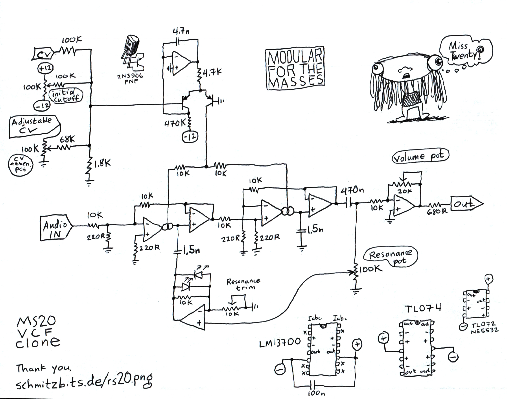

---
title: "MS-20 Filter"
tags: ["vcf", "veroboard", "protoboard"]
--- 

The MS-20 is a synthesizer made by Korg and it has a pretty nice sounding filter. René Schmitz has made a popular clone of it and has schematics avavailable on [his site](https://schmitzbits.de/ms20.html).
There is also a version designed by Kassutronics that adds a pot for blending between low/highpass and a drive knob to attenuate the input signal.

## Schematics

### René Schmitz's schematic (RS-20)

This is a redrawn version with component names matching those on Kassutronics' KS-20 schematic. All credit goes to René Schmitz.

### Luther's redrawn RS-20 schematic
* [GitHub](https://github.com/PierreIsCoding/sdiy/blob/main/MS_20_VCF_Clone/MS20_BY_LP_Schematic.pdf)

### Juanito Moore's schematic (Based on the RS-20)

Juanito has added a trimpot for adjusting the amount of resonance to his design as well as an additional output buffer with volume adjustment.
He has also increased the value of the filter capacitors to 1.5nF.

Build video: [juanito moore - "You can build this MS-20 VCF with me!"](https://youtu.be/uq3TvPBio_g)

### Kassutronics' KS-20 schematic
* [GitHub](https://github.com/kassu/kassutronics/blob/master/documentation/KS-20%20VCF/Kassutronics_KS-20_Build_Docs_1.1C.pdf)

## Veroboard Layouts

### Look Mum No Computer's layout
* [Look Mum No Computer MS-20 stripboard layout (lookmumnocomputer.com)](https://www.lookmumnocomputer.com/simple-filter)

### Sandelinos' Layout (KS-20)

Most component names match the ones in Kassu's schematics [here](https://github.com/kassu/kassutronics/blob/master/documentation/KS-20%20VCF/Kassutronics_KS-20_Build_Docs_1.1C.pdf).

+12V, GND and -12V traces and jumpers have been highlighted with red, black(ish) and blue.

Built and tested by Sandelinos with 2n3906 transistors and purple LEDs. Kassu's original design uses BC557C and green LEDs.
The two TL072s in Kassu's design have been replaced with a single TL074 here and the NE5532 has been replaced with a TL072, use an IC socket so you can stick in an NE5532 if you want.

Using LEDs with a higher forward voltage for D1, D2 will clip the resonance less and give a slightly different sound.

To add more range to the resonance you can decrease the value of R13. René has a 1.8k R13 in his design. A 2k is a more common value and has a great gnarly sound at max resonance, while still giving around 50% range before self oscillating. You can try a 1k or even lower if you want an even more max resonance.

## Perfboard Layouts

### Luther's layout (RS-20)
* [GitHub](https://github.com/PierreIsCoding/sdiy/blob/main/MS_20_VCF_Clone/MS20_PCB_Perfboard.pdf)

## Videos
* [Kristian Blåsol - "Late MS20 HP & LP VCF by Réne Schmitz (2nd MS20 filter) - DIY Modular in a Week 7.4"](https://youtu.be/t-B8FbF8-_8)
* [LOOK MUM NO COMPUTER - "Build An Analog Synth Filter Made EASYYYY."](https://youtu.be/q-2MkTAr4xk)

## Blogs
* [Kassutronics KS-20](https://kassu2000.blogspot.com/2019/07/ks-20-filter.html)
* [AUDIODiWHY blog post about the RS-20](https://audiodiwhy.blogspot.com/2019/02/korg-ms20-filter-why-in-audiodiwhy.html)
* [Eddy Bergman's blog post about the MS-20](https://www.eddybergman.com/2019/12/synthesizer-build-part-12-korg-ms20.html)
* [Eddy Bergman's blog post about a dual MS-20](https://www.eddybergman.com/2020/01/synthesizer-build-part-15-dual-korg-ms.html)
* [Tim Stinchcombes extensive write up with a ton of more links](https://www.timstinchcombe.co.uk/index.php?pge=korg)

## See also
* [Korg 35 Clone VCF](/modules/vcf/korg35)
